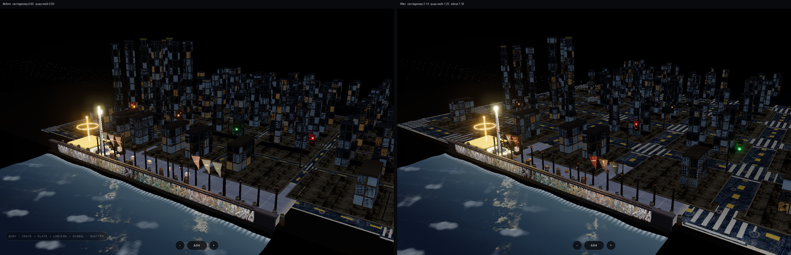
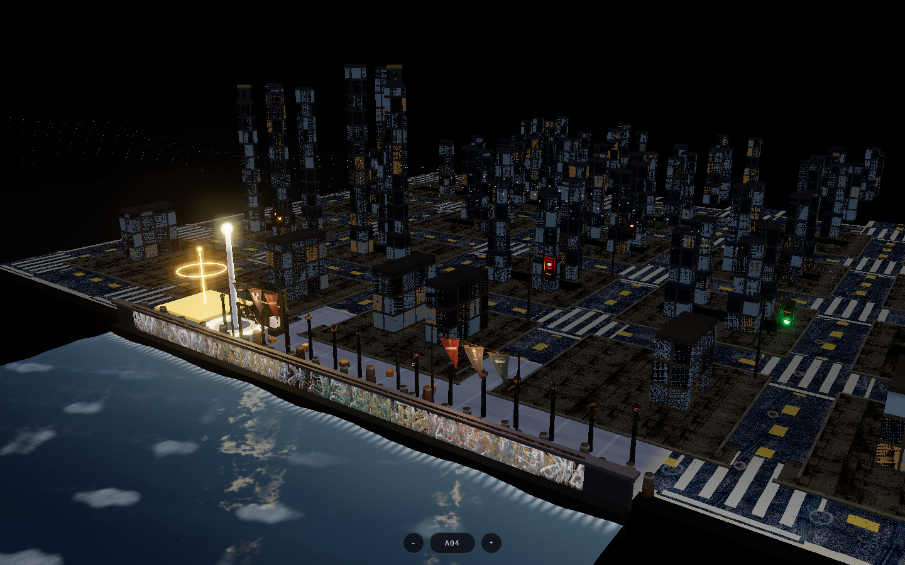
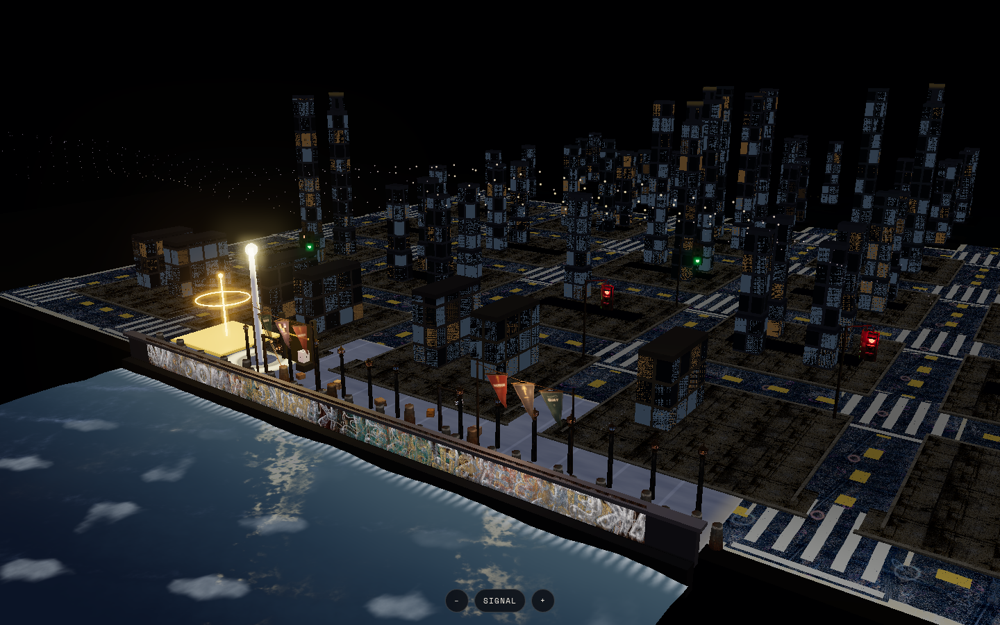

# A04 · Generate — procedural district massing

**Ladder:** advanced craft, drill #4.  
**Map:** Journey *Procedural Terrain* and *Sliced Model* — technique only. Harbor / Signal / Quay / Fenestra grammar. No other marks.

Hand-placed Harbor blocks (`placeBuilding` over the 5×4 lot roll) do not scale. This drill adds an authored generator beside that mesh. It does not replace the intermediate InstancedMesh clutter, the street-atlas sheets, or quay prop-wear.

## What was practiced

- **Height field.** Value noise + fbm. A slow octave sets the district ridge; a faster octave roughens lot to lot. The field is shifted by a seed, so two seeds are two districts. Quay row stays low. A ridge through the middle blocks becomes Signal towers. Hinterland stays shorter.
- **Corridor mask.** Streets use the same cell as Harbor (`BLOCK + STREET`). The primary hard mask is the full street module, `STREET_W` 3.70. Alleys stay narrower: every block cuts a north–south alley 1.16 wide, and every block inland of the quay also cuts a cross alley. Parcels sit behind a 0.52 inset, and each footprint must keep a 0.14 gap from every street and alley or it is shrunk until it does. Courts (low occupancy noise) stay empty. Dark alley ribbons are drawn with the massing pass, inside the block, so the cut reads even on the existing lot pads. A check recomputes the street bands, asserts an 8 cm clearance, and asserts the primary mask and the visible carriageway are both clearly wider than an alley.
- **Sliced mass.** A stack is a fixed 1.48 podium, then a shaft at 70% of that footprint. A crown is allowed only on the tallest lot of a Signal ridge block (not Quay, not the hinterland belt), one crown per block, and the crown is 72% of the shaft so it cannot spill past it. The hard mask runs again on every slice.

The mass is one `InstancedMesh` (`harbor-district-mass`) with a night façade shader: concrete body, 0.76 m fenestra cells, dark mullions, cool glass, rare warm panes. Extension streets past the hand grid are plain night asphalt in this module. They do not bind `uStreetAtlas`.

## Wider corridors

Sidewalks sit inside the street gap, so the lane you see is `STREET_W − 2×SIDEWALK_W`. The old module was 1.65 with 0.50 sidewalks, which left a 0.65 carriageway — narrower than the 1.16 alley. Primary streets now read as main streets. Alleys stay the narrow cut.

| Lane | Width |
|---|---|
| `STREET_W` (hard mask and asphalt module) | 3.70 |
| `SIDEWALK_W` | 0.78 |
| Carriageway (`STREET_W − 2×SIDEWALK_W`) | ~2.14 |
| `QUAY_WALK_W` (north walk of the quay row only) | 1.25 |
| Alley | 1.16 |

The same constants space the hand-placed blocks, sidewalks, curbs, and crosswalks, and they are passed into the generator, so the mask and the asphalt agree. The quay-edge walk is the raised sidewalk on the water side of the first row. Atlas cell sampling is unchanged; only the mesh scale moved. At the default camera the first internal carriageway is about 15 px across before and about 47 px after; the quay walk is about 16 px before and about 40 px after.

## Toggle

The generator does not allocate meshes until it is turned on. Turning it off disposes those geometries and materials, then shows the hand-placed mesh again. The two cities are never both visible. The wider streets stay in both modes, because they are the street module, not a massing-only overlay.

| Control | Effect |
|---|---|
| `harbor.html?generate=1` | Procedural massing on (alias `?massing=1`) |
| `P` | Toggle while the page is open |
| `?seed=signal` | District seed. Presets: `A04`, `signal`, `quay`, `fenestra`. A number or any other word is hashed. |
| Seed bar | Shown only while massing is on. `−` / `+` or `J` / `K` step the presets. Type a seed and press Enter. |
| The bar writes `generate` and `seed` into the URL | Reload keeps the same district. Turning massing off drops `generate` and leaves the seed in place. |

While massing is on, the hand-placed building mesh, lot scars, and rooftop strands hide. Cannon bodies, quay props, pennants, and the photographic street sheets stay as they were. Citizen walk collision is still the hand-placed volumes.

```bash
node noctuary/district-massing.check.mjs
```

`window.__harborMassing` reports instance counts, slice totals, and `corridorsClear`.

## Harbor view

Same camera. Left is the previous 0.65 carriageway; right is the 2.14 carriageway with the 1.25 quay-edge walk. Alleys stay the narrow cut inside the blocks.



Seed `A04`, massing on. Primary streets stay open and wider than the alleys; the seed bar is the only added chrome:



Same camera, seed `signal`. The skyline and courts change; the corridor widths do not:



## Left alone

- `quay-crate` / `quay-iron` atlas wiring and `streetPack` / prop-wear hunks
- Street-ground atlas uniforms and cell sampling on the existing asphalt, sidewalk, and curb meshes (mesh scale changed; the sheets did not)
- Physics and collision for props that already have it
