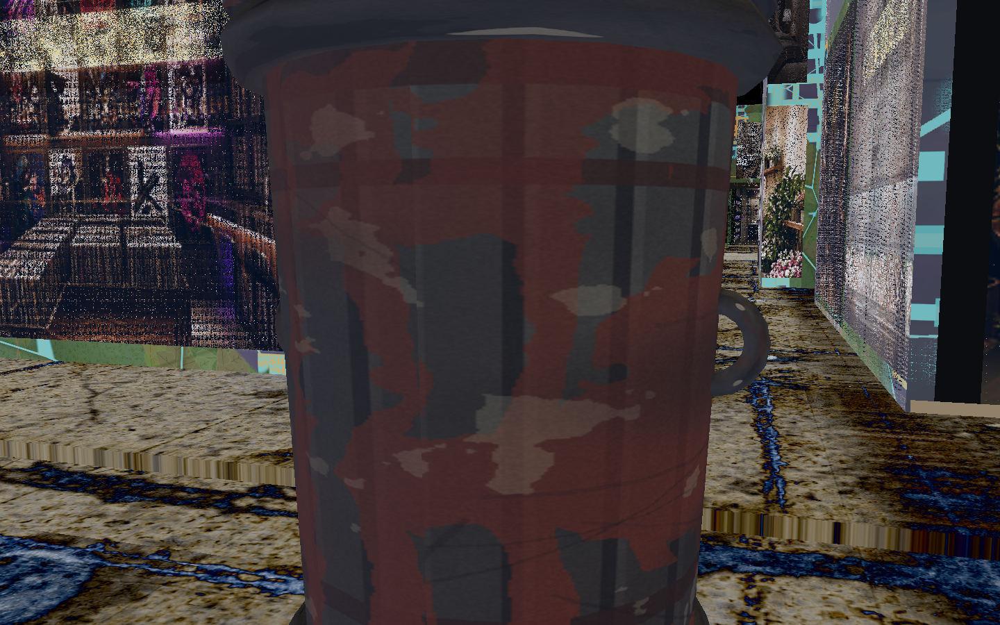
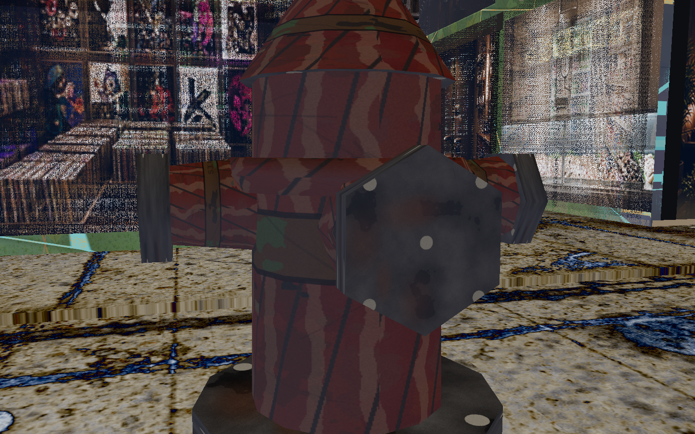
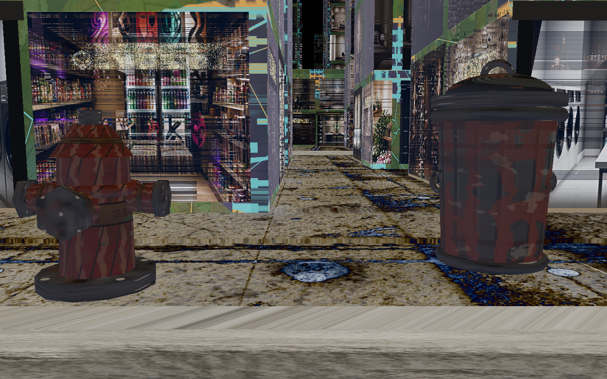
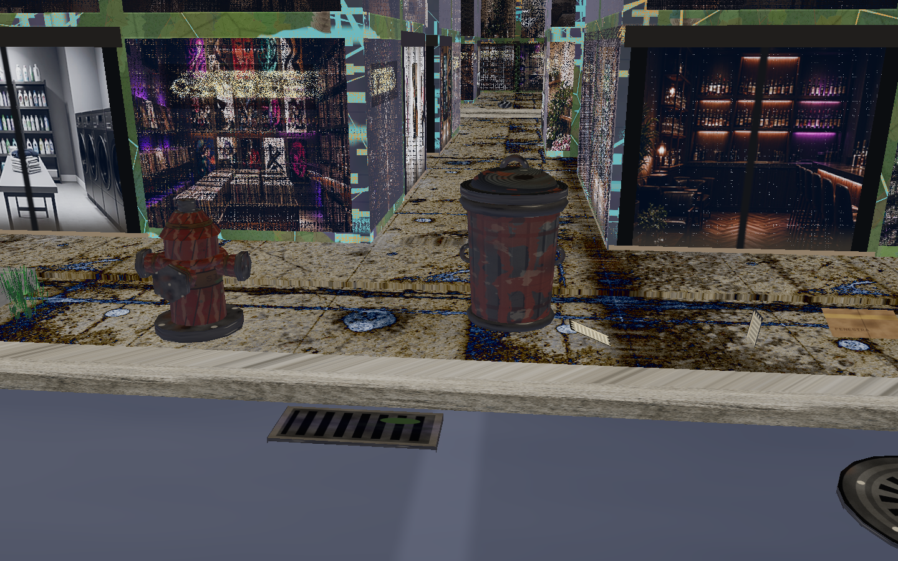
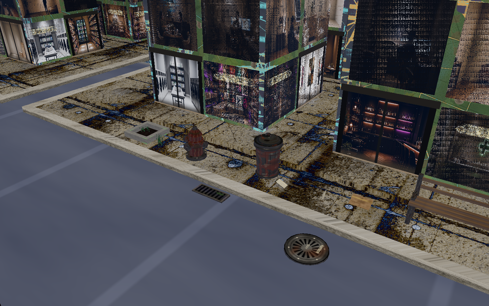
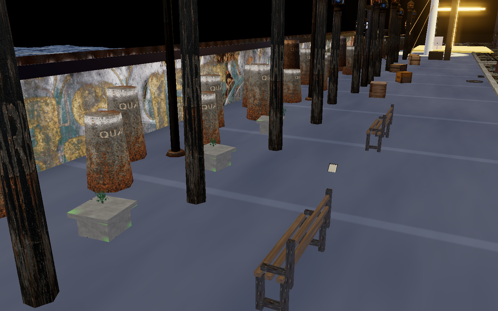

# Street clutter — first pass

Props only. No street-life AI, no NPC sims, no pet pathfinding. Harbor’s live sidewalk, curb, and quay slab stay the anchors. Draft PR #31’s wider module is not merged here.

## What landed

A shared photo sheet and modest `InstancedMesh` furniture along the streets and the east promenade.

| Piece | Where |
|---|---|
| Atlas | `06-intermediate-assets/street-clutter-atlas.png` — 2048², 4×4, row 0 = top of the PNG |
| Bake | `06-intermediate-assets/gen-street-clutter-atlas.py` |
| Placement | `noctuary/street-clutter-plan.mjs` |
| Meshes | `noctuary/street-clutter.js` |
| Glue | `harbor.html` — one mount after the plate / Signal anchors. `L` toggles. `?clutter=0` starts hidden. |

Marks on the sheet are only **HARBOR**, **SIGNAL**, **QUAY**, **FENESTRA**.

### Atlas grammar

Same cell grammar as the street sheet and the freight graffiti band: one shared atlas, V-flipped cell origin, inset so a seam does not bleed. Geometry UVs are baked into a cell. A solid color is the load fallback, not the material.

```
row0  manhole | can metal | bag plastic | tree-pit soil
row1  inlet grate | dumpster panel | litter paper | planter concrete
row2  gutter grate | bin lid | bench timber | weeds (alpha)
row3  inlet throat | cardboard | bench iron | hydrant paint
```

Weed cards discard on alpha. Everything else is opaque. One shader, night fog at the district density, so the props sit in the same air as the asphalt.

Prop-wear `quay-crate` / `quay-iron` sheets are not edited. The quay deck-plate atlas is not edited. This sheet is a new file.

### What is on the street

Taste is fenestra, not a landfill. About fifty pieces on the 5×4 district:

- storm-drain family: curb inlets, gutter grates, manhole covers, dark inlet throats
- refuse: a few cans, two hinterland dumpsters, bags, flat litter, cardboard
- hydrants at the curb: iron flange, red barrel, side caps, a street-facing steamer cap, bonnet, pentagon nut
- benches on the quay-facing walk and the east promenade, with iron end frames and timber slats
- tree pits as a concrete well (raised curb, dark soil, short weeds in the opening), plus curb weeds and quay planters with a lip

The hero cluster is the north walk of the center block (block column 2, quay row), so a street-level frame can read a pit, a hydrant, a can, a bench, a grate, and a cover without touring the whole grid.

### Readability

The ambiguous shape in the first stills was the tree-pit trunk. It was a timber cylinder on the bench-wood cell, topped with flat weed cards, so it read as a stake or a broken bench end between the can and the bench. That pole and crown are gone. The pit is only the well.

Cans are a tapered galvanized bin: bead-and-hoop metal on the can cell, a rolled rim, an overhanging lid (spun-metal cell), a low dome, a bail, and two side lugs. Hydrant paint keeps the barrel, iron caps, tarnished collar, bolt heads, and a small SIGNAL stencil — the silhouette is the hydrant, not the sticker. Bags elsewhere are a tied sack. The hero cluster no longer parks a bag against the can.

The can, lid, and hydrant cells are night-quay wear, the same family as the street sheet and the freight graffiti: dull zinc, faded red, rust bloom, chips through to iron, salt crust, and street dirt. Not a new bin and not factory red. Silhouettes are unchanged.

Cell indices are `[row, col]` with row 0 at the top of the sheet. An earlier read treated that pair as `[col, row]`, so the can wore the inlet cell and the bench legs wore the weed cutout (green wires). They now sample can metal, lid metal, and bench iron.

Flat covers, grates, litter, and cardboard are visual. Cans, dumpsters, hydrants, benches, planters, and the tree-well curb get a static box so a crate does not ghost through them. Those bodies are not in the grab/toss list and do not join the wind or spring hooks. Quay bodies sit a centimeter above the deck so they do not fight the promenade slab.

### Widths

Placement reads the anchors Harbor passes: `STREET_W`, `SIDEWALK_W`, block origin, curb width, sidewalk top, quay slab, seawall. It does not hardcode the old 1.65 lane.

Draft PR #31 (not merged) widens the module to `STREET_W` 3.70, `SIDEWALK_W` 0.78, `QUAY_WALK_W` 1.25, carriageway about 2.14. Those numbers live on the plan as `WIDER_CORRIDORS`. The check runs the same planner twice:

- narrow — this branch’s live mesh (`1.65` / `0.50`)
- wide — #31’s constants, including a 1.25 quay-edge walk on the first row’s north face

On the wide module the open promenade in front of the lanterns is inside the new carriageway, so those benches and planters move onto the quay-edge walk instead of sitting in the lane. On this branch the promenade is still open, and that is where they stand. If a later merge defines `QUAY_WALK_W`, the glue already passes it through.

```bash
node noctuary/street-clutter.check.mjs
```

`window.__streetClutter` reports `counts`, `total`, `live`, `wider`, and `atlas` (`street-clutter-packed` once the sheet binds). `window.__frameClutter('hero' | 'street' | 'quay' | 'detail' | 'can' | 'hydrant')` is the exhibit camera. `detail` frames the can and the hydrant together. `can` and `hydrant` are the close reads. The bench is not the close target.

## Harbor view

Exhibit chrome stays off. Close reads of the weathered can and the hydrant. The bench is outside these frames.





Both of them, still not centered on the bench:



Same cluster from a step back, with the manhole in the lane:



A wider look down the quay street. The furniture stays on the walk and the curb, not in a pile:



East promenade, landward of the lantern posts and clear of the plate and the crates. Benches face the water. Planters sit in the gap before the bollard line:



## Left alone

- `streetPack`, street-atlas uniforms, façade sheath
- `quay-crate` / `quay-iron` wear and the quay deck shader
- cannon crates, hinged lanterns, wind, springs, the plate and the gate
- bollard and lantern instancing already on the quay

## Out of scope for this pass

Do not treat this PR as the rest of the street inventory. Still later, as props only when a pass asks for them:

- pets-as-props
- signs / stickers
- bike racks
- bollards (the quay row already has its own)
- mailboxes
- newspaper boxes
- utility boxes
- lamp extras
- scaffolding / cones
- bus-stop skeleton
- crosswalk paint extras
- A-frames / crates / pallets (quay crates stay on the physics pass)
- quay rope, life rings, cleats, fish crates, salt stains

No pedestrians, no dogs walking, no cars.
